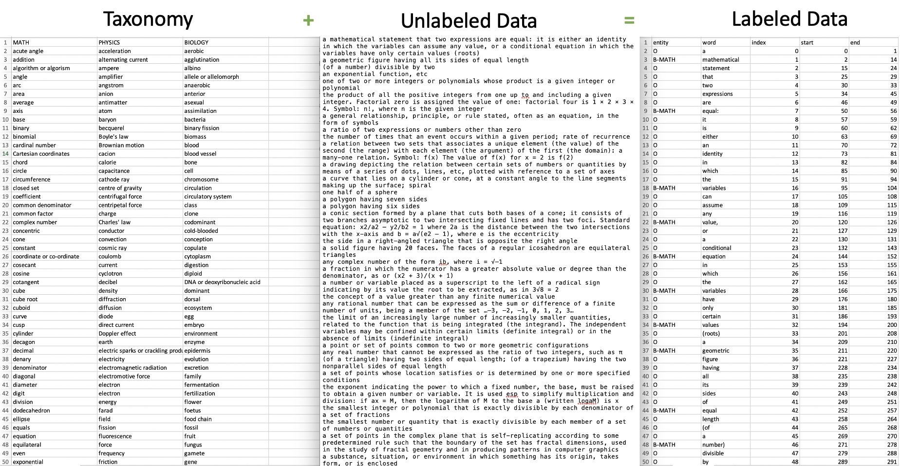

<div id="top"></div>

<!-- NOTES -->
<!--
*** Individual sections below can be removed if not needed
-->

<!-- PROJECT SHIELDS -->
<!--
*** We are using markdown "reference style" links for readability.
*** Reference links are enclosed in brackets [ ] instead of parentheses ( ).
*** See the bottom of this document for the declaration of the reference variables
*** for contributors-url, forks-url, etc. This is an optional, concise syntax you may use.
*** https://www.markdownguide.org/basic-syntax/#reference-style-links
-->
[![Contributors][contributors-shield]][contributors-url]
[![Forks][forks-shield]][forks-url]
[![Stargazers][stars-shield]][stars-url]
[![Issues][issues-shield]][issues-url]
[![Apache 2.0 License][license-shield]][license-url]


<!-- PROJECT LOGO -->
<br />
<div align="center">
  <!-- <a href="https://github.com/Optum/nertag">
    
  </a> -->

<h3 align="center">NERTag</h3>

  <p align="center">
    An automated named-entity recognition tagger
    <br />
    <!-- <a href="https://github.com/Optum/nertag"><strong>Explore the docs »</strong></a> -->
    <!-- <br /> -->
    <!-- <br /> -->
    <!-- <a href="https://github.com/Optum/nertag">View Demo</a>
    ·
    <a href="https://github.com/Optum/nertag/issues">Report Bug</a>
    ·
    <a href="https://github.com/Optum/nertag/issues">Request Feature</a> -->
  </p>
</div>


<!-- TABLE OF CONTENTS -->
<details>
  <summary>Table of Contents</summary>
  <ol>
    <li><a href="#about-the-project">About The Project</a></li>
    <li><a href="#getting-started">Getting Started</a></li>
    <li><a href="#usage">Usage</a></li>
    <li><a href="#contributing">Contributing</a></li>
    <li><a href="#contact">Contact</a></li>
  </ol>
</details>


<!-- ABOUT THE PROJECT -->
## About The Project

<div align="center">
  <a href="assets/screenshot.png">
    
  </a>
</div>

**NERTag** is a nimble python package that automatically tags or labels named entities ([IOB2](https://en.wikipedia.org/wiki/Inside–outside–beginning_(tagging)) format) using a taxonomy or dictionary of terms. It aims to be simple, modular, and fast, and utilizes multiprocessing for large-scale data-labeling. Labeling a document of 1.8 billion characters with a taxonomy of 15k terms and 300 entities takes roughly ~60 minutes, with the main bottleneck stemming from disk I/O.

<p align="right">(<a href="#top">back to top</a>)</p>


<!-- GETTING STARTED -->
## Getting Started

To use **NERTag**, it is recommended to create a [conda](https://www.anaconda.com/products/distribution) virtual environment with Python 3.9+.

```shell
user $ conda create --name nertag python=3.9
user $ conda activate nertag
user (nertag) $ git clone https://github.com/Optum/nertag
user (nertag) $ pip install .
```

<p align="right">(<a href="#top">back to top</a>)</p>


<!-- USAGE EXAMPLES -->
## Usage

**NERTag** is made up of 3 distinct components:

1. Text preprocessing: defines text preprocessing to use
2. Base labeling behavior: defines default text labeling behavior
3. Tagging algorithm: defines how to label entities

In this example, the tagging algorithm utilizes a taxonomy of terms.

---

A toy example is provided below.

<details>
<summary>Sample code</summary>

```python
import pandas as pd
from nertag import ner, preprocess, utils, tagging

# --- Taxonomy
path = "taxonomy.csv"
df = utils.preprocess_df(
    pd.read_csv(path), stemmer=utils.lemmatizer, filters=utils.stop_words, tokenizer=utils.tokenizer
)
dct = utils.setup_dict(df)

# --- Data
texts = [
    "my account is closed",
    "my account is locked what account can i use to unlock it",
    "how do i check my fsa",
    "Also known as second molars. Back teeth that come in at around the age of 12.",
    "Hello. Need to update my account info, where can I make updates to my account address information?",
    "Need to update address information because I want to make account updates.",
]

# --- Pipeline
# NOTE: By default, punctuation is removed, words are stemmed, whitespaces are replaced with a single space, and stopwords are removed.
preprocessor = ner.Preprocessor(
    preprocess.preprocess,
    stemmer=utils.lemmatizer,
    stop_words=utils.stop_words,
    start=4,
    stop=0,
    step=-1,
)
baselabeler = ner.BaseLabeler(utils.base_label, utils.tokenizer)
tagger = ner.Tagger(tagging.ner_tagging, dct)
pipeline = ner.NER(preprocessor, baselabeler, tagger)

results = pipeline.sequential_labeling(texts)

print(results)
```

</details>

<details>
<summary>Sample output</summary>

```shell
my account is closed
            entity     word  index  start  end
0                O       my      0      0    2
1  B-cancellations  account      1      3   10
2  I-cancellations       is      2     11   13
3  I-cancellations   closed      3     14   20

my account is locked what account can i use to unlock it
              entity     word  index  start  end
0                  O       my      0      0    2
1   B-account locked  account      1      3   10
2   I-account locked       is      2     11   13
3   I-account locked   locked      3     14   20
4   I-account locked     what      4     21   25
5   I-account locked  account      5     26   33
6                  O      can      6     34   37
7                  O        i      7     38   39
8         B-common1k      use      8     40   43
9                  O       to      9     44   46
10                 O   unlock     10     47   53
11                 O       it     11     54   56

how do i check my fsa
                            entity   word  index  start  end
0                                O    how      0      0    3
1                                O     do      1      4    6
2                                O      i      2      7    8
3                       B-common1k  check      3      9   14
4                                O     my      4     15   17
5  B-FSA:Flexible Spending Account    fsa      5     18   21

Also known as second molars. Back teeth that come in at around the age of 12.
              entity     word  index  start  end
0         B-common1k     Also      0      0    4
1                  O    known      1      5   10
2                  O       as      2     11   13
3         B-common1k   second      3     14   20
4           B-dental  molars.      4     21   28
5         B-common1k     Back      5     29   33
6   B-35:Dental Care    teeth      6     34   39
7                  O     that      7     40   44
8         B-common1k     come      8     45   49
9                  O       in      9     50   52
10                 O       at     10     53   55
11                 O   around     11     56   62
12                 O      the     12     63   66
13                 O      age     13     67   70
14                 O       of     14     71   73
15                 O      12.     15     74   77

Hello. Need to update my account info, where can I make updates to my account address information?
              entity          word  index  start  end
0                  O        Hello.      0      0    6
1   B-account update          Need      1      7   11
2   I-account update            to      2     12   14
3   I-account update        update      3     15   21
4                  O            my      4     22   24
5                  O       account      5     25   32
6                  O         info,      6     33   38
7                  O         where      7     39   44
8                  O           can      8     45   48
9                  O             I      9     49   50
10  B-account update          make     10     51   55
11  I-account update       updates     11     56   63
12                 O            to     12     64   66
13                 O            my     13     67   69
14                 O       account     14     70   77
15         B-address       address     15     78   85
16         I-address  information?     16     86   98

Need to update address information because I want to make account updates.
              entity         word  index  start  end
0         B-common1k         Need      0      0    4
1                  O           to      1      5    7
2   B-account update       update      2      8   14
3   I-account update      address      3     15   22
4   I-account update  information      4     23   34
5                  O      because      5     35   42
6                  O            I      6     43   44
7         B-common1k         want      7     45   49
8                  O           to      8     50   52
9         B-common1k         make      9     53   57
10  B-account update      account     10     58   65
11  I-account update     updates.     11     66   74
```

</details>

_For more examples, please refer to [notebooks](notebooks) and [examples](examples)_

<p align="right">(<a href="#top">back to top</a>)</p>


<!-- CONTRIBUTING -->
## Contributing

Contributions are what make the open source community such an amazing place to learn, inspire, and create. Any contributions you make are **greatly appreciated**.

If you have a suggestion that would make this better, please fork the repo and create a pull request. You can also simply open an issue with the tag "enhancement".
Don't forget to give the project a star! Thanks again!

1. Fork the Project
2. Create your Feature Branch (`git checkout -b feature/AmazingFeature`)
3. Commit your Changes (`git commit -m 'Add some AmazingFeature'`)
4. Push to the Branch (`git push origin feature/AmazingFeature`)
5. Open a Pull Request

<p align="right">(<a href="#top">back to top</a>)</p>


<!-- MAINTAINERS -->
## Contact

- Brandon Hsu
  - GitHub: [thbhsu](https://github.com/thebhsu)
  - Email: thebhsu@gmail.com

<p align="right">(<a href="#top">back to top</a>)</p>


<!-- MARKDOWN LINKS & IMAGES -->
<!-- https://www.markdownguide.org/basic-syntax/#reference-style-links -->
[contributors-shield]: https://img.shields.io/github/contributors/Optum/nertag.svg?style=for-the-badge
[contributors-url]: https://github.com/Optum/nertag/graphs/contributors
[forks-shield]: https://img.shields.io/github/forks/Optum/nertag.svg?style=for-the-badge
[forks-url]: https://github.com/Optum/nertag/network/members
[stars-shield]: https://img.shields.io/github/stars/Optum/nertag.svg?style=for-the-badge
[stars-url]: https://github.com/Optum/nertag/stargazers
[issues-shield]: https://img.shields.io/github/issues/Optum/nertag.svg?style=for-the-badge
[issues-url]: https://github.com/Optum/nertag/issues
[license-shield]: https://img.shields.io/github/license/Optum/nertag.svg?style=for-the-badge
[license-url]: LICENSE
